> # **On the U.S. County Level, is Distance to Food Banks a Predictor for Food Insecurity?**

## Background
___

Food banks have been a staple of citizenship and generosity in America for decades. As we all know, the COVID-19 pandemic has caused a public health and economic crisis, and the effects of these are extensive.

The repercussions will include an increase in hardship for those populations who were already vulnerable, including the number of people experiencing food insecurity. Food insecurity is defined as “the state of being without reliable access to a sufficient quantity of affordable, nutritious food.” According to the United Nations, COVID-19 could ​double the global food insecurity rate!

As the pandemic continues, unemployment has ascended, and demand has spiked at food banks and food pantries across the United States. This will likely result in worse health outcomes for the general population who rely on food banks, and more so in times of crisis.

COVID-19 has highlighted the necessity for food banks in many communities in America. 

## Purpose
___

The project sought to understand how well distributed Food Bank networks were in the US. 
​

The focus or aim of the project was to answer the question:

***On the U.S. County Level, is Distance to Food Banks a Predictor for Food Insecurity?***

## Tools Used
---
**Machine Learning**:  Scikit-Learn

**Visualizations**:  Tableau, Matlplotlib, Seaborn, Statsmodels

**Web**:  HTML, CSS, Flask, JavaScript, Heroku

## Data Sources
---

| Dataset          | Year          | Source        | Date Retrieved | 
| ------------- | ------------- | ------------- | -------------  | 
| [Food Insecurity Rate](https://www.feedingamerica.org/research/coronavirus-hunger-research)  | 2018-2020  | Feeding America – ​The Impact of Coronavirus on Food Insecurity​, Map the Meal Gap (October, 2020). |December 8, 2020  | 
| [FIPS Codes Dataset](https://www2.census.gov/geo/docs/reference/codes/files/national_county.txt)  | 2010  | Data.world retrieved from the U.S. Government Census (2010). | January 20, 2021 | 
| [Food Bank Locations](https://www.feedingamerica.org/find-your-local-foodbank) | Current  | Feeding America Organization | January 19, 2021 | 
| [County Demographics](https://www.ers.usda.gov/data-products/county-level-data-sets/download-data/)  | 2019  | U.S. Department of Agriculture – Economic Research Service (USDA)  | December 12, 2020 | 
| [County Distance Dataset (100 miles)](https://www.nber.org/research/data/county-distance-database) | 2010  | National Bureau of Economic Research (NBER)  | January 18, 2021 | 

## Findings
___

> ### Boston Heatmap

<table>
  <tr>
    <td>Areas with a higher population tend to have a higher number of food banks.</td>
  </tr>
  <tr>
    <td valign="top">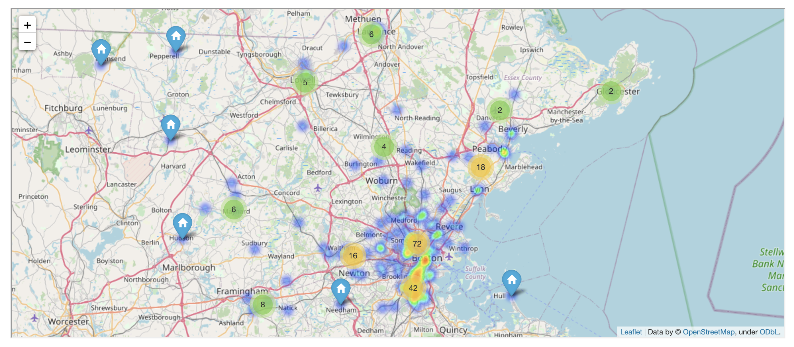</td>
  </tr>
 </table>

 > ### Food Insecurity in the USA - Interactive Visualization

The visualizations contain large bubbles that show counties with foodbanks within a 100 mile radius, while the smaller bubbles do not have foodbanks within a 100 mile radius. 

The range in color of the bubbles symbolizes the variable rate (Food Insecurity, Poverty Rate, Unemployment Rate).

<table>
  <tr>
    <td>Food Insecurity</td>
    <td>Poverty Rate</td>
    <td>Unemployment Rate</td>
  </tr>
  <tr>
    <td valign="top">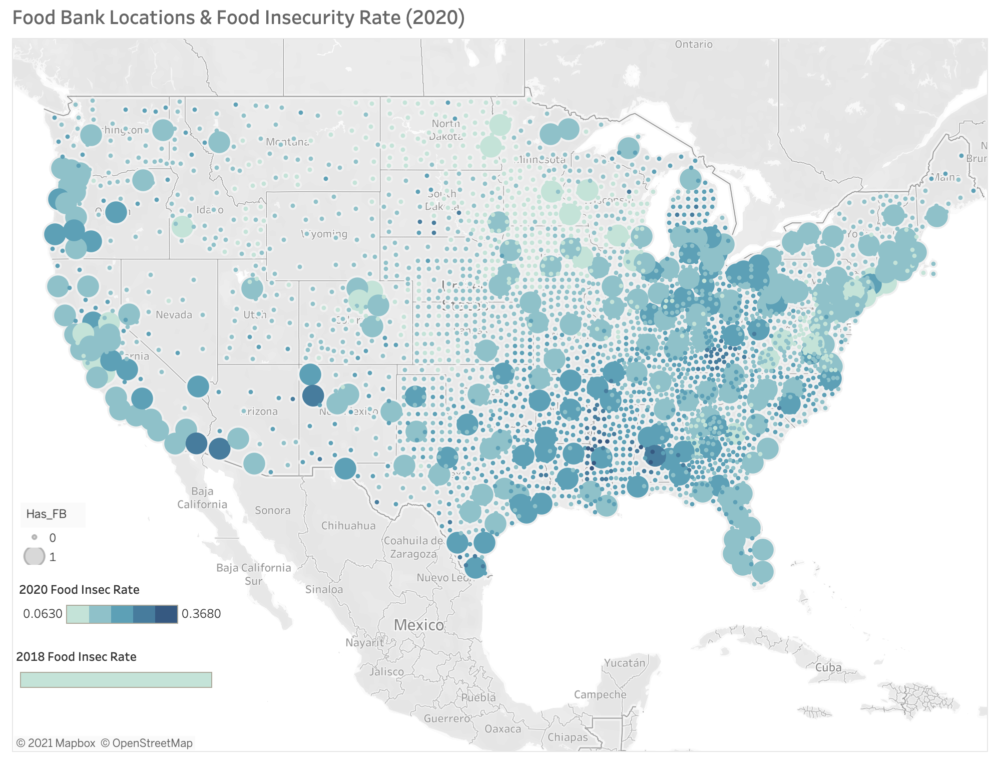</td>
    <td valign="top">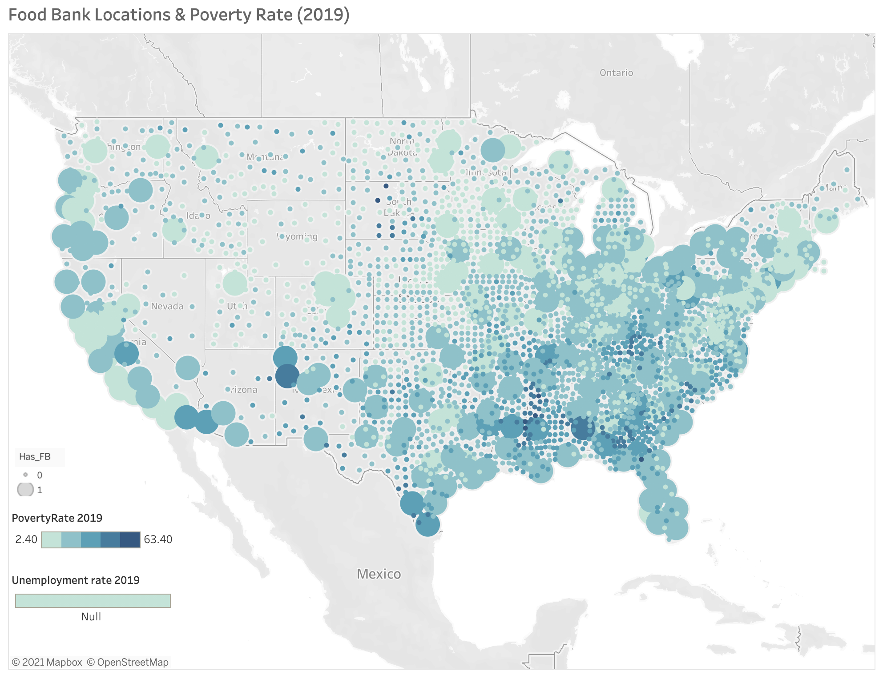</td>
    <td valign="top">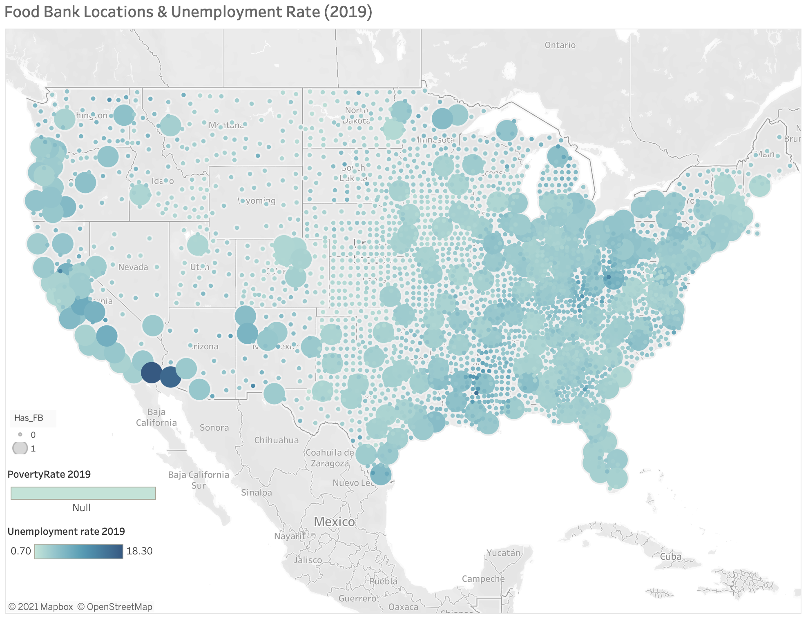</td>
  </tr>
 </table>

 ## Analysis
___

 > ### Linear Regression Model 

Displaying the food insecurity rate change from 2018 to 2020 as a function of distance to the nearest food bank in miles in United States counties. Our scalar variable is distance and our explanatory variable is food insecurity. If a food bank exists in a county, the distance would be 0.

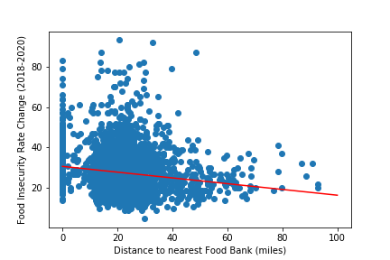

 > ### Linear Probability Models

We decided to use Linear Probability models to interpret the county demographic data: poverty rate, unemployment rate, and education. How does the demographics of a county affect the probability that a county contains a food bank?

<table>
  <tr>
    <td>Poverty Rate</td>
    <td>Unemployment Rate</td>
  </tr>
  <tr>
    <td valign="top">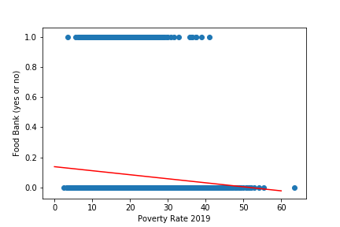</td>
    <td valign="top">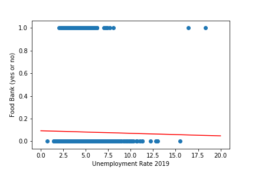</td>
  </tr>
 </table>

<table>
  <tr>
    <td>Percentage of adults with less than a HS diploma</td>
    <td>Percentage of adults with a HS diploma</td>
  </tr>
  <tr>
    <td valign="top">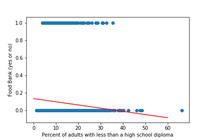</td>
    <td valign="top">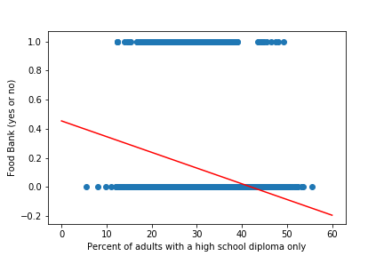</td>
  </tr>
 </table>

 <table>
  <tr>
    <td>Percentage of adults completing some college or associates degree.</td>
    <td>Percentage of adults with a Bachelors degree or higher</td>
  </tr>
  <tr>
    <td valign="top">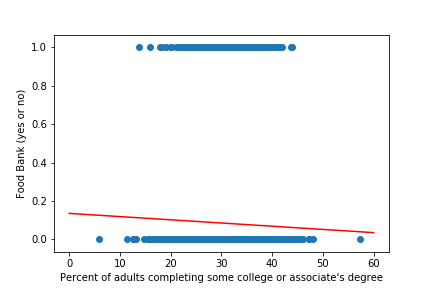</td>
    <td valign="top">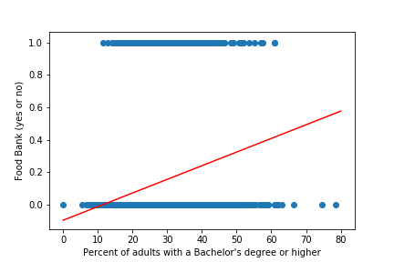</td>
  </tr>
 </table>

 The downward slope of the line shows there is a negative correlation for three of the education categories, but the coefficients are so low that there is not a strong correlation. The interesting point here is that counties with a higher percentage of people with bachelor's degree or higher have a higher probability of having a food bank within the county or nearby.

  > ### Interaction Model

After looking at the linear probability models, we decided to add another variable to our linear regression model -- education. We took the median of the percentage of people with a bachelor's degree or higher and then assigned a binary variable to all the counties, higher than the medium percentage of people with a bachelor's degree or higher and lower than the medium percentage of people with a bachelor's degree or higher.

<table>
  <tr>
    <td>Interaction Model</td>
    <td>OLS Regression Results</td>
  </tr>
  <tr>
    <td valign="top">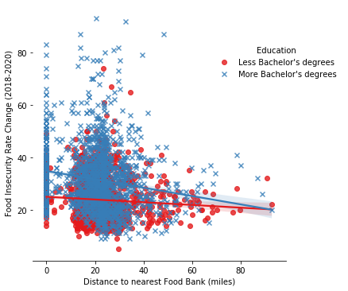</td>
    <td valign="top"></td>
  </tr>
 </table>