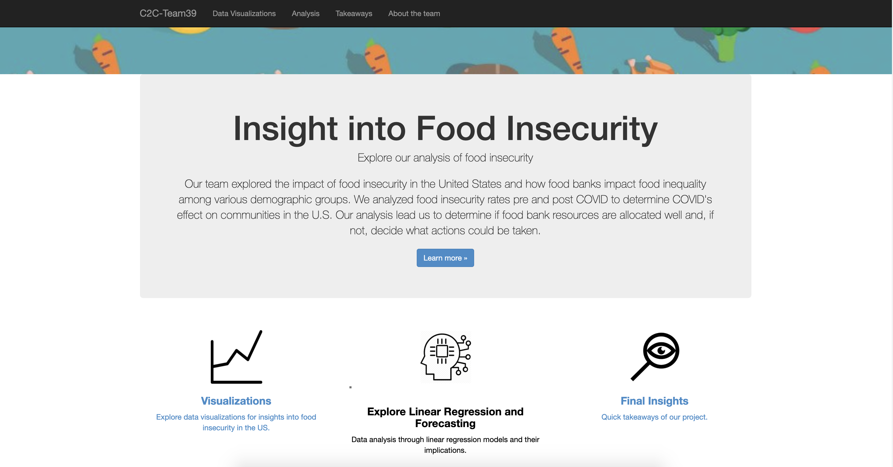

# c2c-team39
# On the U.S. County Level, is Distance to Food Banks a Predictor for Food Insecurity?

## Background
___

Food banks have been a staple of citizenship and generosity in America for decades. As we all know, the COVID-19 pandemic has caused a public health and economic crisis, and the effects of these are extensive.

The repercussions will include an increase in hardship for those populations who were already vulnerable, including the number of people experiencing food insecurity. Food insecurity is defined as “the state of being without reliable access to a sufficient quantity of affordable, nutritious food.” According to the United Nations, COVID-19 could ​double the global food insecurity rate!

As the pandemic continues, unemployment has ascended, and demand has spiked at food banks and food pantries across the United States. This will likely result in worse health outcomes for the general population who rely on food banks, and more so in times of crisis.

COVID-19 has highlighted the necessity for food banks in many communities in America. 

## Purpose
___

The project sought to understand how well distributed the network of food banks is in the US. 
​
The aim of the project was to answer the question: On the U.S. County Level, is Distance to Food Banks a Predictor for Food Insecurity?

## Tools Used
---

## Data Sources
---

| Data          | Year          | Source        | Date Retrieved | 
| ------------- | ------------- | ------------- | -------------  | 
| [Food Insecurity Rate](https://www.feedingamerica.org/research/coronavirus-hunger-research)  | 2018-2020  | Feeding America – ​The Impact of Coronavirus on Food Insecurity​, Map the Meal Gap (October, 2020). |December 8, 2020  | 
| [FIPS Codes Dataset](https://www2.census.gov/geo/docs/reference/codes/files/national_county.txt)  | 2010  | Data.world retrieved from the U.S. Government Census (2010). | January 20, 2021 | 
| [Food Bank Locations](https://www.feedingamerica.org/find-your-local-foodbank) | Current  | Feeding America Organization | January 19, 2021 | 
| [County Demographics](https://www.ers.usda.gov/data-products/county-level-data-sets/download-data/)  | 2019  | U.S. Department of Agriculture – Economic Research Service (USDA)  | December 12, 2020 | 
| [County Distance Dataset (100 miles)](https://www.nber.org/research/data/county-distance-database) | 2010  | National Bureau of Economic Research (NBER)  | January 18, 2020 | 
